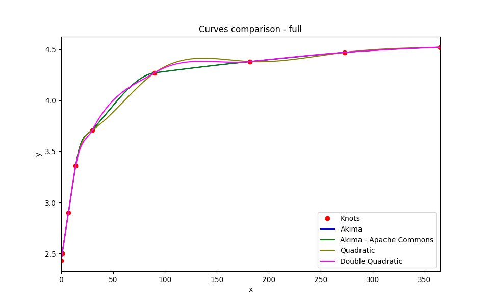

# org.blacksmith.finlib

Set of financial libraries

[Cucumber tests see here](src/test/resources/features)

## 1. Market data

### 1.1. Foreign Exchange Rates

[Source code see here](src/main/java/org/blacksmith/finlib/rates/fxrates)

FxRateService - service that helps converts between currencies.
##### How to Exchange Currency
Currency can be converted using an online currency exchange, or it can be performed manually.
To use second method, you must first look up the exchange rate using an online exchange rate calculator or calculate if by yourself.

Let's conduct a dollar-to-euro conversion, for example. First, look up the exchange rate online using a website such as xe.com, which will be quoted as the amount $1 can buy in euros or as the amount one euro will buy in dollars.  
If $1 buys 0.8230 euros, then $10,000 would equal 8,230 euros (because 10,000 x 0.8230 = 8,230). If the quote states that one euro buys $1.215, then $10,000 still would equal 10,215 euros (because 10,000 x 1.2150 = 12,500).
Quotation in other words defines how amount in one currency can be translated to another.
One of the concepts describing quotation is the Currency Pair. 

Currency Pair has the following attributes:
- base currency - is the currency we convert from, eg. EUR, USD, JPY
- counter currency - is the currency we convert to, eg. EUR, USD, JPY
- factor - defines additional factor. Some pairs, e.g. USD/JPY HUF/PLN are quoted at 100 to avoid low/high numbers
- cross flag - if true, then exchange rate is be calculated using three currencies: base, counter and domestic

#### Example 1 - the domestic currency is EUR and the following pairs and rates are defined

##### Currency pairs
|Base currency|Counter currency|Is cross|Factor|
|:---:|:---:|:---:|:---:|
|EUR|USD|No|1|
|EUR|JPY|No|1|
|EUR|HUF|No|1|
|EUR|PLN|No|1|
|USD|PLN|Yes|-|
|USD|JPY|Yes|-|
|USD|HUF|Yes|-|
|JPY|HUF|Yes|-|
|JPY|PLN|Yes|-|
|HUF|PLN|Yes|-|

#### Exchange rates
|Date|Base currency|Counter currency|Exchange rate|
|---|:---:|:---:|---:|
|2020/05/15|EUR|USD|1.215|
|2020/05/15|EUR|JPY|132.85|
|2020/05/15|EUR|HUF|348.669|
|2020/05/15|EUR|PLN|4.55|

#### Effective rates calculated using source rates and pairs
Let's look at some rate calculations:
1) Dollar-to-Euro and Euro-to-Dollar conversion -EUR/USD currency pair is defined.

Conversion EUR->USD is made directly using exchange rate (1.215), and USD->EUR indirectly (1 / 1.215 = 0.823045).

2) Dollar-to-Yen and Yen-to-Dollar conversion - USD/JPY "cross" currency pair is defined.

Conversion USD->JPY is made "through" EUR (132.82 / 1.21 = 109.341564), and JPY->USD opposite (1.21 / 132.82 = 0.009146).

|Date|From currency|To currency|Exchange rate|Description|
|---|:---:|:---:|---:|:---:|
|2020/05/15|EUR|HUF|348.669000|direct|
|2020/05/15|EUR|JPY|132.850000|direct|
|2020/05/15|EUR|PLN|4.550000|direct|
|2020/05/15|EUR|USD|1.215000|direct|
|2020/05/15|HUF|EUR|0.002868|indirect|
|2020/05/15|HUF|JPY|0.381020|cross|
|2020/05/15|HUF|PLN|0.013050|cross|
|2020/05/15|HUF|USD|0.003485|cross|
|2020/05/15|JPY|EUR|0.007527|indirect|
|2020/05/15|JPY|HUF|2.624531|cross|
|2020/05/15|JPY|PLN|0.034249|cross|
|2020/05/15|JPY|USD|0.009146|cross|
|2020/05/15|PLN|EUR|0.219780|indirect|
|2020/05/15|PLN|HUF|76.630549|cross|
|2020/05/15|PLN|JPY|29.197802|cross|
|2020/05/15|PLN|USD|0.267033|cross|
|2020/05/15|USD|EUR|0.823045|indirect|
|2020/05/15|USD|HUF|286.970370|cross|
|2020/05/15|USD|JPY|109.341564|cross|
|2020/05/15|USD|PLN|3.744856|cross|

#### Example 2 - the domestic currency is PLN  and the following pairs and rates are defined

##### Currency pairs
|Base currency|Counter currency|Is cross|Factor|
|:---:|:---:|:---:|:---:|
|EUR|PLN|No|1|
|USD|PLN|No|1|
|JPY|PLN|No|100|
|HUF|PLN|No|100|
|EUR|USD|Yes|-|
|EUR|HUF|Yes|-|
|EUR|JPY|Yes|-|
|USD|HUF|Yes|-|
|USD|JPY|Yes|-|
|JPY|HUF|Yes|-|
#### Exchange rates
|Date|Base currency|Counter currency|Exchange rate|
|---|:---:|:---:|---:|
| 2021-05-15 | EUR  | PLN | 4.5    |
| 2021-05-15 | USD  | PLN | 3.74   |
| 2021-05-15 | HUF  | PLN | 1.2863 |
| 2021-05-15 | JPY  | PLN | 3.4249 |
#### Effective rates calculated using source rates and pairs
Let's look at some rate calculations:
1) Euro-to-Polish-Zloty and Polish-Zloty-to-euro - EUR/PLN currency pair is defined

Conversion EUR->PLN is made directly using exchange rate (4.55), and PLN->EUR indirectly (1 / 4.55 = 0.219780).

2) Yen-to-Polish-Zloty and Polish-Zloty-to-Yen - YPY/PLN currency pair with factor is defined

Conversion YEN->PLN is made directly using exchange rate (3.4250 / 100 = 0.034250), and PLN->YEN indirectly (100 / 3.4250 = 29.197080).

3) Dollar-to-Euro and Euro-to-Dollar conversion - EUR/USD "cross" currency pair is defined.

Conversion EUR->USD is made "through" PLN ing exchange rate (4.55 / 3.75 = 1.213333), and USD->EUR opposite (3.75 / 4.55 = 0.824176).

4) Dollar-to-Yen and Yen-to-Dollar conversion - USD/JPY "cross" currency pair is defined.

Conversion USD->JPY is made "through" PLN (100 * 3.75 / 3.4250 = 109.489051), and JPY->USD opposite (3.4250 / (100 * 3.75)=0.009133).

5) Yen-to-Forint and Forint-to-Yen conversion - JPY/HUF "cross" currency pair is defined.

Conversion JPY->HUF is made "through" PLN (100 * 3.4250 / (100 * 1.2864) = 2.662469), and HUF->JPY opposite (100 * 1.2864 / (100 * 3.4250) = 0.375591).

|Date|From currency|To currency|Exchange rate|Description|
|---|:---:|:---:|---:|:---:|
|2021-05-15|EUR|HUF|353.700249|cross|
|2021-05-15|EUR|JPY|132.846715|cross|
|2021-05-15|EUR|PLN|4.550000|direct|
|2021-05-15|EUR|USD|1.213333|cross|
|2021-05-15|HUF|EUR|0.002827|cross|
|2021-05-15|HUF|JPY|0.375591|cross|
|2021-05-15|HUF|PLN|0.012864|direct|
|2021-05-15|HUF|USD|0.003430|cross|
|2021-05-15|JPY|EUR|0.007527|cross|
|2021-05-15|JPY|HUF|2.662469|cross|
|2021-05-15|JPY|PLN|0.034250|direct|
|2021-05-15|JPY|USD|0.009133|cross|
|2021-05-15|PLN|EUR|0.219780|indirect|
|2021-05-15|PLN|HUF|77.736318|indirect|
|2021-05-15|PLN|USD|0.266667|indirect|
|2021-05-15|PLN|JPY|29.197080|indirect|
|2021-05-15|USD|EUR|0.824176|cross|
|2021-05-15|USD|HUF|291.511194|cross|
|2021-05-15|USD|PLN|3.750000|direct|
|2021-05-15|USD|JPY|109.489051|cross|
## 2. Calendars

[Source code see here](src/main/java/org/blacksmith/finlib/calendar)

## 3. Calculations
### 3.1 Business day conventions
[Source code see here](src/main/java/org/blacksmith/finlib/dayconvention)
### 3.2 Xirr
[Source code see here](src/main/java/org/blacksmith/finlib/math/xirr)

Calculates Xirr - the internal rate of return for cash flows. One of two algorithms can be used:
- BiSection method
- Newton-Raphson method

Newton-Raphson method consumes 2-3x fewer iterations than BiSection

How to use? Look at the tests

- XirrBuilderTest.java - how to use builders
- XirrCalculatorTest.java - it uses cucumber tests definition (xirr.feature)

### 3.3 Interest calculation
[Source code see here](src/main/java/org/blacksmith/finlib/interest)

### 3.4 Yield curves

[Source code see here](src/main/java/org/blacksmith/finlib/curve)

The Akima spline algorithm was published by Hiroshi Akima in 1970. It could be particularly useful for Interpolation and smooth Curve Fitting.

This method avoids overshooting issues common with many other splines (e.g., cubic splines), resulting in a more natural curve.
Blacksmith implementation of Akima Polynominal algorithm is based on original paper of Hiroshi Akima, and it behaves more predictably than Apache Commons, and the difference is visible around inflection points.

Figure 1. Full Chart - 365 days

Figure 2. 20 days - case with inflection point

Figure 3. 20 days - case without inflection point
