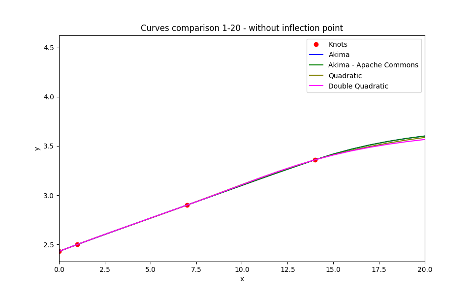

## Curves

### 1. Interpolation
#### 1.1. Akima spline algorithm

The Akima spline algorithm was published by Hiroshi Akima in 1970. It could be particularly useful for Interpolation and smooth Curve Fitting.

This method avoids overshooting issues common with many other splines (e.g., cubic splines), resulting in a more natural curve.
Blacksmith implementation of Akima Polynomial algorithm is based on original paper of Hiroshi Akima, and it behaves more predictably than Apache Commons, and the difference is visible around inflection points.

Figure 1. Full Chart - 365 days

Figure 2. 20 days - case with inflection point

Figure 3. 20 days - case without inflection point

[Source code see here](../src/main/java/org/blacksmith/finlib/curve)

[Tests see here](../src/test/java/org/blacksmith/finlib/curve)

[Benchmarks see here](../src/jmh/java/org/blacksmith/finlib/curve)

[Benchmarks results see here](../src/jmh/resources)
